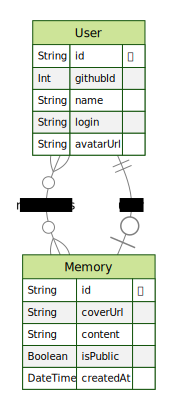

<div align="center">
  
</div>
<br>

# NLW - SPACETIME API
API desenvolvida durante a NLW#12 - Spacetime.

Está aplicação foi criada utilizando `NodeJS`, `Typescript`, `Prisma`, `Docker` e `Postgresql`.

## Regras da aplicação
  - [x] Deve ser possível cadastrar uma memória
  - [x] Deve ser possível listar todos as memórias de um usuário
  - [x] Deve ser possível listar uma memória específica do usuário
  - [x] Deve ser possível atualizar os dados de uma memória
  - [x] Deve ser possível deletar uma memória
  - [x] Deve ser possível se autenticar utilizando o GITHUB

## Requisitos não funcionais
  - [x] Os dados da aplicação precisam estar persistidos em um banco PostgreSQL
  - [x] O usuário deve ser identificado por um JWT (Json Web Token)
  - [x] Os usuários precisam estar com uma autenticação válida para acessar as rotas '/memories'


## Instalação
```sh
# Faça o clone do repotório
  git clone git@github.com:RenanFachin/RS_NLW_space-time-server.git

# Instalar as dependências do projeto
  npm install

# Subindo o banco de dados com docker
  docker compose up -d

# Rodar as migrations do projeto para criar o banco de dados
  npx prisma migrate dev

# Executando o projeto no ambiente de desenvolvimento
  npm run dev
```

## Diagrama ERD
<div align="center">
    
</div>

## Rotas
- Autenticação
```bash
POST /register
```

- Criar uma nova memória
```bash
POST /memories
```

- Listar TODAS memórias
```bash
GET /memories
```

- Listar UMA memória específica
```bash
GET /memories/:{id}
```

- Atualizar UMA memória específica
```bash
PUT /memories/:{id}
```

- Deletar UMA memória
```bash
DELETE /memories/:{id}
```